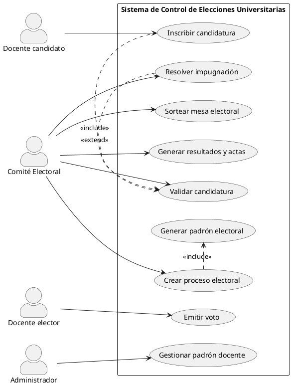

# Contexto del Proyecto: Sistema de Control de Elecciones Universitarias (UNP)

> Documento de contexto para el agente de desarrollo. Léelo completo antes de generar código, diagramas o estructura de proyecto. Resume el dominio, los requisitos, la arquitectura y las convenciones acordadas hasta ahora.

## 1. Qué se está construyendo

Un sistema web para gestionar los procesos de **elección de autoridades universitarias** en la Universidad Nacional de Piura (UNP), conforme a la Ley Universitaria N° 30220 (Perú). Es uno de tres sistemas de un curso universitario que sigue la metodología **RUP (Rational Unified Process)**; este documento cubre únicamente el **Sistema 3: Control de Elecciones Universitarias**.

El objetivo del sistema es automatizar y dar trazabilidad a todo el ciclo electoral: mantenimiento del padrón docente, inscripción y validación de candidaturas, generación del padrón electoral, sorteo de mesas, votación y publicación de resultados.

## 2. Dominio del problema

- La universidad se organiza en **Facultad → Escuela Profesional**, y en paralelo, **Departamento Académico**.
- Los **docentes pertenecen al Departamento Académico** (no directamente a la Escuela), aunque pueden dictar en distintas escuelas.
- Categorías docentes (según Ley 30220): **Principal, Asociado, Auxiliar**.
- Tipos de dedicación: **tiempo completo, tiempo parcial, dedicación exclusiva** — inciden en la elegibilidad para votar/postular.
- Los cargos administrativos vigentes (**Rector, Decano, Jefe de Departamento, Director de Escuela**, etc.) **inhabilitan** a un docente para ser miembro de mesa por sorteo.
- Los propios **candidatos** de un proceso tampoco pueden ser sorteados como miembros de mesa en ese proceso.
- El **secreto del voto** debe preservarse incluso a nivel de base de datos: se puede saber *quién votó* (para el quórum) pero no *por quién votó*.

## 3. Objetos del negocio

| Tipo | Objeto | Descripción |
|---|---|---|
| Worker | Comité Electoral Universitario | Organiza y supervisa el proceso; valida candidaturas y resuelve impugnaciones |
| Worker | Docente Elector | Docente habilitado para votar según su categoría |
| Worker | Docente Candidato | Docente que postula a un cargo |
| Worker | Miembro de Mesa Electoral | Docente sorteado (Presidente, Secretario, Vocal) |
| Entity | Padrón Docente | Base de datos de todos los docentes con facultad/escuela/departamento/categoría |
| Entity | Proceso Electoral | Convocatoria con cronograma, cargos y estado |
| Entity | Candidatura | Postulación con estado: aprobada / observada / rechazada |
| Entity | Padrón Electoral | Lista de docentes habilitados para votar, generada por cargo dentro de un proceso |
| Entity | Mesa Electoral / Acta | Miembros sorteados y acta de instalación/cierre |
| Entity | Voto | Opción elegida, sin vínculo directo a la identidad del docente |

## 4. Casos de uso del negocio

- **Realizar Proceso Electoral Universitario** (Comité Electoral) — proceso completo, de convocatoria a resultados.
- **Conformar Mesa Electoral** (Comité Electoral) — sorteo de titulares y suplentes.
- **Inscribir Candidatura** (Docente Candidato).
- **Emitir Voto** (Docente Elector).
- **Resolver Impugnación** (Comité Electoral).

## 5. Requerimientos funcionales

| Código | Requerimiento |
|---|---|
| RF01 | Registrar y mantener el padrón docente (facultad, escuela, departamento, categoría) |
| RF02 | Crear un proceso electoral con cronograma y cargos a elegir |
| RF03 | Definir por cargo qué categorías docentes pueden votar y postular |
| RF04 | Registrar y validar candidaturas (aprobada / observada / rechazada) |
| RF05 | Generar automáticamente el padrón electoral por cargo |
| RF06 | Sortear 5 miembros de mesa (+ suplentes), excluyendo cargos administrativos vigentes y candidatos del proceso |
| RF07 | Asignar roles a los miembros de mesa (Presidente, Secretario, Vocales) |
| RF08 | Registrar un voto por docente por cargo, validando habilitación en el padrón electoral |
| RF09 | Registrar el voto sin vincularlo a la identidad del votante |
| RF10 | Generar conteo de resultados y actas por facultad al cierre |

## 6. Requerimientos no funcionales

| Código | Requerimiento |
|---|---|
| RNF01 | El sorteo debe ser auditable (guardar semilla/log del algoritmo, fecha y hora) |
| RNF02 | Garantizar la confidencialidad del voto en todo momento, incluso frente a administradores |
| RNF03 | Accesible desde navegadores web estándar |
| RNF04 | Soportar votación concurrente de todos los docentes habilitados sin degradar el rendimiento |
| RNF05 | Mantener auditoría de acciones administrativas sin exponer datos del voto |

## 7. Reglas de negocio clave

- Un docente vota una sola vez por cada cargo en elección.
- La habilitación para votar/postular depende de categoría, antigüedad y ausencia de sanciones (según estatuto).
- El catálogo de cargos excluidos del sorteo debe ser **configurable** por el Comité Electoral (no fijo en código).
- El sorteo debe ser reproducible y verificable ante posibles impugnaciones.

## 8. Arquitectura de software (definida)

Arquitectura **en capas (n-capas)**, cliente-servidor web, patrón **MVC** en el backend:

```
[Actores externos: Docente, Comité Electoral, Administrador]
        │
Capa de Presentación        → formularios web (votación, inscripción, padrón)
        │
Capa de Lógica de Negocio    → Controlador Padrón, Controlador Sorteo, Controlador Votación
        │
Capa de Acceso a Datos       → Repositorios / patrón DAO-Repository
        │
Capa de Persistencia         → Base de datos relacional (PostgreSQL / MySQL)
```

**Regla de diseño crítica:** el `VotoRepository` NO debe tener llave foránea directa hacia `Docente`; solo se relaciona con `PadronElectoral` (que certifica que el docente ya votó), para separar la identidad del votante de la opción elegida.

Sugerencia de stack (a confirmar con el equipo): backend en un framework MVC (p. ej. Spring Boot, Django o Laravel), frontend web simple (HTML/CSS/JS o un framework ligero), base de datos relacional PostgreSQL.

## 9. Diagrama general de casos de uso (PlantUML)



**Descripción breve de cada caso de uso:**
- **Inscribir candidatura**: el docente candidato registra su postulación a un cargo.
- **Validar candidatura**: el Comité Electoral verifica requisitos y aprueba/observa/rechaza.
- **Crear proceso electoral**: el Comité Electoral define cronograma, cargos y categorías habilitadas.
- **Generar padrón electoral**: se ejecuta automáticamente (include) al crear el proceso; filtra docentes habilitados por cargo.
- **Emitir voto**: el docente elector vota una vez por cargo, sin vincularse a su identidad.
- **Gestionar padrón docente**: el administrador mantiene la base de datos de docentes.
- **Sortear mesa electoral**: sorteo aleatorio de 5 miembros + suplentes, excluyendo cargos administrativos y candidatos.
- **Generar resultados y actas**: conteo y cierre de actas por facultad.
- **Resolver impugnación**: atención de reclamos (extiende opcionalmente la validación de candidatura).

## 10. Estado actual del proyecto (RUP)

Ya completado:
- Modelado del negocio: dominio del problema, objetos del negocio, casos de uso del negocio.
- Requerimientos funcionales y no funcionales.
- Arquitectura general en capas.
- Diagrama general de casos de uso (nivel sistema).

Pendiente (próximos entregables):
- Diagramas de secuencia por caso de uso de sistema (ej. "Emitir voto", "Sortear mesa electoral").
- Diagrama de clases de diseño (Boundary / Control / Entity detallados con atributos y métodos).
- Modelo de persistencia (mapeo a esquema de base de datos).
- Vista de despliegue (dónde corre cada capa: navegador, servidor de aplicaciones, servidor de BD).
- Definición formal de roles del equipo: Arquitecto, Diseñador de software, Diseñador de base de datos.

## 11. Convención para diagramas de aquí en adelante

Todos los diagramas UML del proyecto (casos de uso, secuencia, clases, etc.) se generan en **código PlantUML**, no en imágenes sueltas, para que sean versionables y editables como texto plano.

## 12. Instrucciones para el agente

- Trata este documento como la fuente de verdad del dominio y los requisitos ya acordados; no reinventes entidades ni reglas de negocio que ya están definidas aquí.
- Si necesitas generar código, estructura de proyecto o diagramas adicionales, respeta la arquitectura en capas y el aislamiento del secreto del voto descrito en la sección 8.
- Cualquier diagrama UML debe entregarse en formato PlantUML.
- Ante ambigüedad en una regla de negocio no cubierta aquí, señala la duda explícitamente en vez de asumir un comportamiento.
